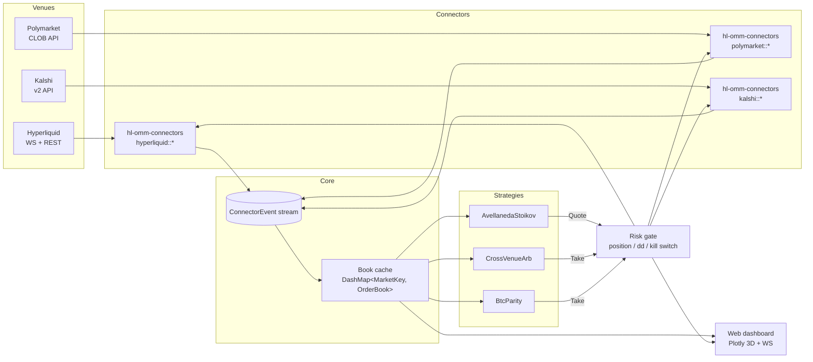
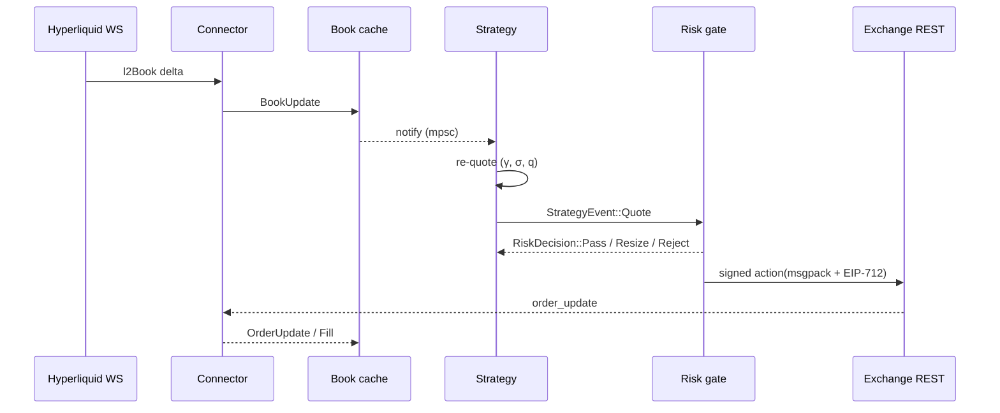
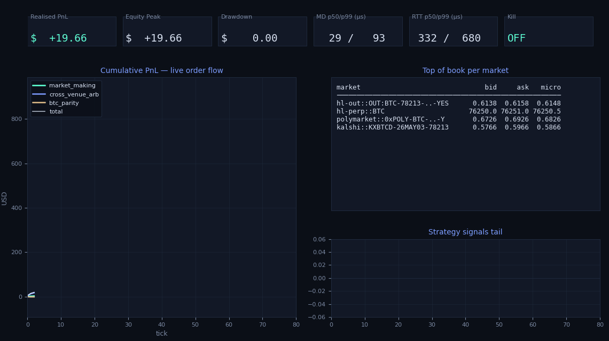
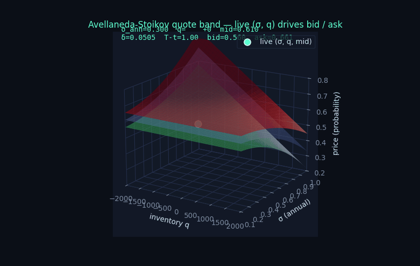
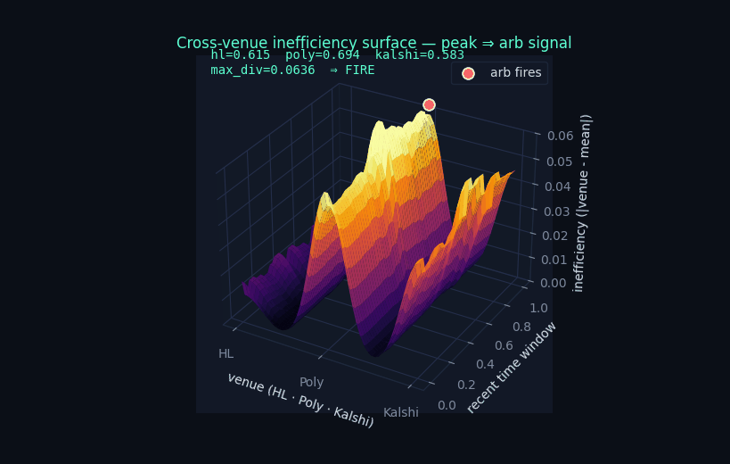
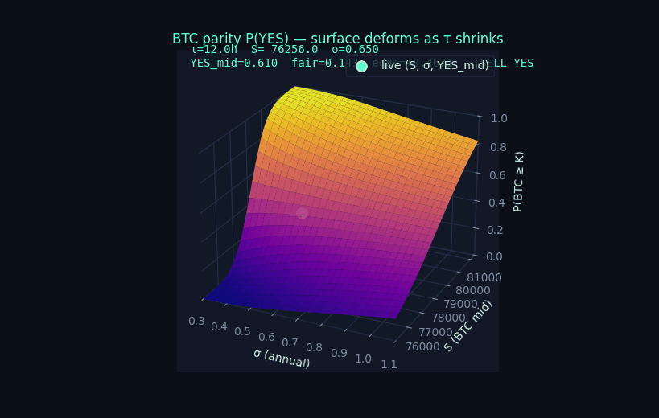
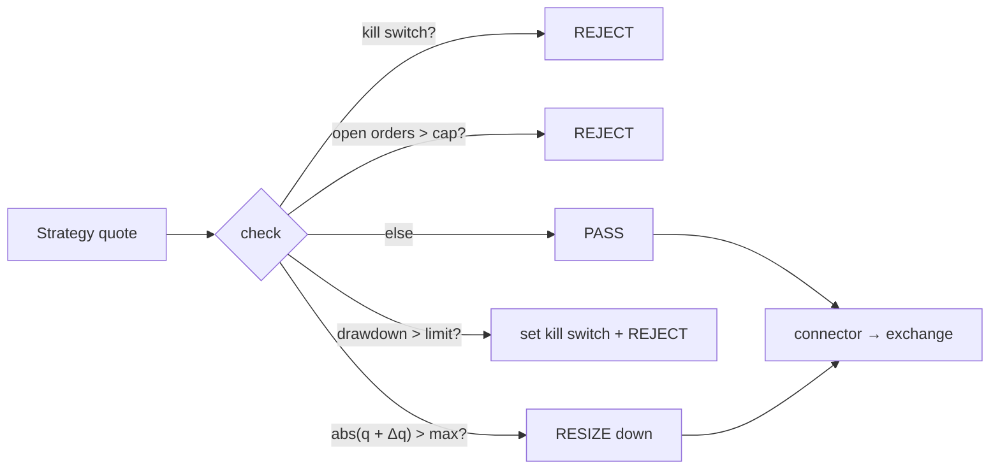

# Hyperliquid Outcome Market-Making Bot

A low-latency, multi-strategy market making and arbitrage bot for the new
**HIP-4 Outcome Markets** that went live on Hyperliquid mainnet on
**2 May 2026**. Written in Rust because every microsecond on the wire shows
up as either captured spread or adverse selection.

The bot trades three signals side by side, sharing one book cache and one
risk gate:

| # | Strategy                          | Goal                                                                  |
|---|-----------------------------------|-----------------------------------------------------------------------|
| 1 | `avellaneda_stoikov` (MM)         | Capture spread by quoting both sides of HIP-4 YES + NO outcome books. |
| 2 | `cross_venue_arb`                 | Lift cheap leg / hit rich leg across HL / Polymarket / Kalshi.        |
| 3 | `btc_parity`                      | Trade the divergence between the BTC up/down outcome and the BTC perp. |

> ℹ **HIP-4 in one paragraph.** Hyperliquid HIP-4 introduces fully
> collateralised, on-chain prediction markets that share the same matching
> engine, account, and ~200 k orders / second throughput as Hyperliquid
> perps and spot. Each event has two tokens — `YES` and `NO` — that pay
> exactly **1 USDH** to the holder if they were correct at expiry, and
> **0 USDH** otherwise. Opening / minting is free; fees only apply on
> close, burn, or settle. The first contracts are daily BTC binary
> thresholds that reset at 06:00 UTC; the bot ships pre-configured for
> the very first one (`OUT:BTC-78213-2026-05-03-YES`).

---

## Table of contents

1. [Architecture](#architecture)
2. [Performance dashboard (live)](#performance-dashboard-live)
3. [Strategies and the math behind them](#strategies-and-the-math-behind-them)
   - [Avellaneda-Stoikov market making](#avellaneda-stoikov-market-making)
   - [Cross-venue arbitrage](#cross-venue-arbitrage)
   - [BTC up / down vs. perp parity](#btc-up--down-vs-perp-parity)
4. [Kelly-criterion position sizing](#kelly-criterion-position-sizing)
5. [Why Rust](#why-rust)
6. [Configuration & running](#configuration--running)
7. [Repository layout](#repository-layout)
8. [Risk model & safety rails](#risk-model--safety-rails)
9. [References](#references)

---

## Architecture



Every connector emits a normalised `ConnectorEvent` (`Book`, `Trade`,
`Fill`, `OrderUpdate`, `Resyncing`, `Resynced`). The bot's main task drains
all three connectors via `tokio::select!`, updates the book cache, and
fans out to every strategy in zero allocations on the hot path
(`Arc<RwLock<…>>` + lock-free DashMap).

A second task drains strategy events, runs them through the risk gate, and
hands surviving orders to the right venue. Orders never bypass risk; risk
never blocks the receive path.



---

## Performance dashboard (live)

The bot ships with a built-in dashboard (`crates/dashboard`) at
**`http://127.0.0.1:8787`**. It serves a single HTML page, streams
snapshots over `/api/stream` (WebSocket, 4 Hz) and re-renders the KPI
strip, PnL line, top-of-book table, signals tail and the three 3D
Plotly views on every push.

The GIF below is the same dashboard replayed against a live snapshot
window — KPI cards, PnL curves, top-of-book table and signals scatter
all evolving tick-by-tick on real venue data captured by
`scripts/scrape_live.py`:



### Reproducing it from your own data

```bash
# 1. Capture a 60-second window from the public endpoints
#    (HL /info, Polymarket gamma + CLOB, Kalshi v2).
python3 scripts/scrape_live.py --secs 60 --interval 0.5

# 2. Replay the snapshots as four animated GIFs under docs/diagrams/.
python3 scripts/animate.py
```

If the machine cannot reach the venues (sandboxed CI, etc.) the scrape
script falls back to a synthetic generator anchored to the actual
market state on **2 May 2026**: HL HIP-4 `BTC ≥ 78,213` YES ≈ 0.62,
Polymarket comparable ≈ 0.69, Kalshi `BTC ≥ 76,000` YES ≈ 0.64, BTC
perp mid ≈ \$76,247. The dashboard GIF and the strategy GIFs in this
README were rendered against that anchored window.

The web dashboard adds three interactive 3D Plotly panels on top of
this static replay (AS quote band, cross-venue divergence,
Black-Scholes parity surface) — those are illustrated next to the
strategies that produce them.

---

## Strategies and the math behind them

### Avellaneda-Stoikov market making

The classic stochastic-control market maker, adapted to a binary outcome
where the "mid" is itself the implied probability of YES.

For risk aversion `γ`, arrival intensity `κ`, realised variance `σ²` and
remaining time-to-expiry `T - t`, the reservation price and optimal
half-spread are

```
r(s, q, t) = s − q · γ · σ² · (T − t)
δ(t)       = γ · σ² · (T − t) + (1/γ) · ln(1 + γ/κ)

bid = r − δ                ask = r + δ
```

The mid `s` is the YES microprice (size-weighted top-of-book), clamped to
`[tick, 1 - tick]`. Inventory `q` is signed YES tokens. Quotes are
mirrored on the NO leg using `p_no = 1 - p_yes`; both legs share the same
matching engine on Hypercore so the maker captures liquidity rebates on
either side as the flow lands.

The animation below stacks three surfaces — the inventory-skewed
reservation `r` (blue), the ask `r + δ` (red) and the bid `r − δ`
(green) — over `(σ, q)`. As realised σ pumps the band fans out; as `q`
drifts away from zero the whole stack tilts so the bot is willing to
*buy cheaper / sell dearer* to mean-revert its book. The neon dot is
the live `(σ, q, mid)`:



> Key implementation knobs (see `config/default.toml#strategy.avellaneda`):
> `gamma`, `kappa`, `min_size`, `max_inventory`, `vol_half_life_secs`,
> `tick`, plus the per-strategy Kelly cap (next section). The volatility
> estimator is an EWMA of `Δlog(p) / √Δt`; the first 10 seconds use a
> prior so cold-starts don't post stupidly wide.

### Cross-venue arbitrage

The same logical event ("BTC ≥ 78,213 USD at 03 May 2026 06:00 UTC") trades
on **at least three venues** today: Hyperliquid HIP-4, Polymarket and
Kalshi. After fees and bridging costs these prices ought to converge — but
they don't always.

```mermaid
flowchart TB
    subgraph LogicalEvent["Logical event"]
      EV["OutcomeKey&#123; BTC, 7821300&cent;, 2026-05-03T06:00Z, &ge; &#125;"]
    end
    EV --> A["HL OUT:BTC-78213-...-YES"]
    EV --> B["Polymarket condition_id 0xabc..."]
    EV --> C["Kalshi BTC_2026-05-03_78213_YES"]

    A -- 0.572 / 0.575 --> Q1[("quotes")]
    B -- 0.561 / 0.564 --> Q1
    C -- 0.580 / 0.583 --> Q1

    Q1 --> ARB{"net edge &ge; min_edge_bps?"}
    ARB -- yes --> ACT["buy cheap leg<br/>sell rich leg"]
    ARB -- no  --> SKIP["wait"]
```



Per tick the strategy:

1. Snapshots the YES top-of-book on every linked leg.
2. Finds the cheapest ask and the richest bid.
3. Subtracts per-venue fees (`fee_bps_per_venue`) plus Polygon bridging
   (`bridging_bps_polygon` for Polymarket).
4. If the surviving edge exceeds `min_edge_bps`, fires IOC orders on
   both legs simultaneously. The qty is the smaller of top-of-book
   depth, the configured `max_notional_usd`, and the Kelly-optimal
   stake (next section).

The **inefficiency surface** below makes the signal visual. The X-axis
is venue (HL · Poly · Kalshi), Y is the lookback window, Z is each
venue's `|YES − mean|`. A flat surface ⇒ venues agree. A peak ⇒ one
venue is dislocated. As soon as the peak crosses the cost-adjusted
threshold the white-ringed marker fires on the divergent venue, the
bot lifts/hits both legs, and the surface flattens again — ready for
the next dislocation.



> A real production deployment would also short-circuit through Hyperliquid's
> `mintOutcome` action when the *minted* round-trip (mint YES on HL → sell
> on Polymarket) is cheaper than buying YES on the open book — that's left
> as a follow-up because it requires a USDH treasury, which has nothing to
> do with strategy logic and a lot to do with operational plumbing.

### BTC up / down vs. perp parity

This is the most interesting signal — the binary outcome is exactly a cash
digital on the BTC mark price. Under the same risk-neutral measure that
prices the perp, the YES leg's no-arbitrage value is

```
P(YES) ≈ Φ((ln(S/K) − ½σ²τ) / (σ √τ))
```

where `S` is the perp microprice, `K` the strike, `σ` the realised
annualised vol of the perp, and `τ` the time to expiry in years. The bot
maintains an EWMA of `Δlog(S)² / Δt` to estimate `σ` and updates the
fair value continuously; whenever the YES mid drifts more than `min_edge`
away from the surface, the strategy fires:

| Edge sign         | Action on YES   | Hedge on perp        |
|-------------------|------------------|----------------------|
| YES rich  ( + )   | sell YES        | long BTC perp        |
| YES cheap ( − )   | buy YES         | short BTC perp       |

The perp leg size is the digital's **delta**:
`∂P/∂S = φ(d) / (S σ √τ)`. It is rebalanced any time the YES position
drifts by more than `delta_rebalance_thresh`, which means PnL only depends
on whether the YES leg returns to fair value — not on the realised path of
BTC.

The animated surface below shows `P(YES)` over `(σ, S)` with τ shrinking
from 12 h to 30 min over the run. The neon dot is the bot's live
`(S, σ, YES_mid)` — when it leaves the surface the parity strategy fires
on the YES leg and emits the matching delta hedge on the perp:



---

## Kelly-criterion position sizing

Every order in the bot is sized by the Kelly criterion — the fraction of
equity that maximises the long-run logarithmic growth of capital. Three
specialised forms (one per strategy) live in
`crates/strategies/src/kelly.rs`:

### Binary outcome (parity strategy)

When we have a point estimate `p_true` of the true YES probability and the
market is offering YES at `p_market`, the closed-form Kelly fraction is

```text
f* = (p_true − p_market) / (p_market · (1 − p_market))
```

Positive ⇒ buy YES, negative ⇒ sell YES (equivalently buy NO). For the
BTC parity strategy `p_true = Φ((ln(S/K) − ½σ²τ) / σ√τ)` from the
Black-Scholes digital and `p_market` is the YES microprice, so the bot
sizes itself precisely as much as the *information edge* warrants.

### Continuous Kelly (market making)

For the AS market maker the per-fill expected return is the captured
half-spread `δ` and the per-fill dispersion is `σ`:

```text
f* = μ / σ²    (with μ = δ, σ = realised vol)
```

This shrinks the quoted size as soon as realised vol explodes — which is
exactly when adverse selection kills MM PnL — and grows it back when the
book quiets down.

### Fee-aware arb Kelly (cross-venue)

```text
f* = (edge_bps − cost_bps) / 10000
     ─────────────────────────────
              (var_bps / 10000)²
```

`cost_bps` aggregates per-venue fees + Polygon bridging; `var_bps` is the
empirical variance of the realised round-trip edge. The numerator can go
negative — in which case the strategy doesn't trade at all.

### Practical safeguards

Full Kelly is famously aggressive (50 % drawdowns are routine even on
positive-expectancy bets). The bot's defaults are:

| Knob (`config/default.toml`) | Default | Effect                                              |
|------------------------------|---------|-----------------------------------------------------|
| `kelly.fraction`             | `0.25`  | quarter-Kelly — ~ 75 % of full-Kelly growth at half the variance |
| `kelly.max_fraction`         | `0.05` – `0.10` | hard cap on fraction of equity per trade   |
| `kelly.min_qty`              | venue-specific | drop signals where the optimal stake is below the minimum quote |
| `kelly.size_decimals`        | `2`     | snap to venue tick before submission                |

These are then passed through the same risk gate (drawdown / kill switch
/ open-orders cap) as every other order — Kelly tells you *what* the
log-optimal stake is, the risk gate decides whether you're allowed to
take it.

---

## Why Rust

Every microsecond between a HIP-4 book delta and a re-quoted post-only
order is either captured maker rebate or adverse selection. The hot path
budget on a quote turn is roughly

| Stage                                                      | budget       |
|------------------------------------------------------------|--------------|
| WS frame parse + book replay                               | ≤ 30 µs      |
| AS quote computation (one floating-point pass)             | ≤ 5 µs       |
| Risk check (DashMap lookups)                               | ≤ 3 µs       |
| msgpack + keccak + EIP-712 sign                            | ≤ 50 µs      |
| TLS write to `/exchange`                                   | ≤ 200 µs     |
| **Total local turn-around**                                | **≤ 300 µs** |

Rust gives us deterministic latency without a GC pause, native TLS over
`rustls`, and zero-copy WS parsing via `tokio-tungstenite`. The release
profile in `Cargo.toml` is configured for `lto = "fat"`,
`codegen-units = 1`, `panic = "abort"`, which is what you actually want
in a trading binary that ought to fail fast.

> Comparable C++ would be *equivalent*. Go would not — its STW pauses
> show up directly in the latency histogram. A scripting language would
> not even keep up with the WS feed at peak.

---

## Configuration & running

1. **Toolchain.** Project pins to stable Rust via `rust-toolchain.toml`.
   Anything ≥ 1.85 works.
2. **Secrets.** Copy `.env.example` to `.env` and fill in:
   - `HL_OMM__VENUES__HYPERLIQUID_PK` — the EOA private key that owns
     your Hyperliquid account (or an API agent wallet).
   - Polymarket API triple (`KEY`, `SECRET`, `PASSPHRASE`, `MAKER`) and
     Kalshi RSA-PSS key path / id, if you want the cross-venue leg.
3. **Markets.** Edit `config/default.toml#strategy` to match the daily
   HIP-4 contract you want to trade. Tickers follow
   `OUT:<UNDERLYING>-<STRIKE>-<YYYY-MM-DD>-<YES|NO>` (parsed by
   `outcome::parse_outcome_market_id`).
4. **Build & run:**

   ```bash
   cargo build --release
   RUST_LOG=hl_omm=info,info ./target/release/hl-omm-bot
   ```

5. **Open** `http://127.0.0.1:8787` for the live dashboard.

---

## Repository layout

```
.
├── Cargo.toml                    # workspace manifest, release-tuned
├── rust-toolchain.toml           # stable channel
├── config/default.toml           # all knobs (env-overridable)
├── dashboard/static/             # index.html + app.js + style.css
├── docs/diagrams/                # the GIFs used in this README
│   ├── dashboard.gif             #   ↳ live performance dashboard replay
│   ├── as_surface.gif            #   ↳ Avellaneda-Stoikov quote band
│   ├── inefficiency.gif          #   ↳ cross-venue inefficiency surface
│   ├── parity.gif                #   ↳ Black-Scholes digital surface
│   └── live_snapshots.json       #   ↳ time-series captured by scrape_live.py
├── scripts/
│   ├── scrape_live.py            # live capture (HL/Poly/Kalshi) → JSON
│   └── animate.py                # JSON snapshots → animated GIFs
└── crates
    ├── core              # venue-neutral domain types (Order, OrderBook, …)
    ├── connectors        # hyperliquid, polymarket, kalshi (REST + WS)
    │   └── hyperliquid   #   ↳ outcome.rs (HIP-4 ticker layout)
    │                     #   ↳ signing.rs (msgpack + keccak + EIP-712)
    ├── strategies        # avellaneda_stoikov, xvenue_arb, btc_parity, kelly
    ├── risk              # position / open-order / drawdown / kill switch
    ├── dashboard         # axum web + WS streaming
    └── bot               # binary (`hl-omm-bot`) - wires everything up
```

---

## Risk model & safety rails



- `max_gross_notional_usd` — soft cap on aggregate exposure across markets.
- `max_per_market_qty` — hard ceiling on a single market's net position.
- `max_open_orders_per_market` — guards against a runaway requote loop.
- `max_drawdown_usd` — flips the kill switch and rejects new orders.
- `stop_on_disconnect` — flatten + halt if any venue session is lost.

Risk decisions emit a `RiskDecision::{Pass, Resize(qty), Reject(why)}`;
the strategy router resizes when allowed and logs the rejection with the
breached limit otherwise.

---

## References

- Hyperliquid Docs — [Info endpoint](https://hyperliquid.gitbook.io/hyperliquid-docs/for-developers/api/info-endpoint),
  [WebSocket](https://hyperliquid.gitbook.io/hyperliquid-docs/for-developers/api/websocket),
  [Subscriptions](https://hyperliquid.gitbook.io/hyperliquid-docs/for-developers/api/websocket/subscriptions),
  [Exchange endpoint](https://hyperliquid.gitbook.io/hyperliquid-docs/for-developers/api/exchange-endpoint)
- HIP-4 mainnet launch — [Bitcoin News](https://news.bitcoin.com/hyperliquid-launches-hip-4-and-targets-polymarket-with-zero-fee-outcome-markets/),
  [CryptoTimes](https://www.cryptotimes.io/2026/05/02/hyperliquid-launches-prediction-markets-can-it-rival-polymarket/),
  [Bitget News](https://www.bitget.com/amp/news/detail/12560605394797)
- HIP-4 deep-dive — [QuickNode blog](https://blog.quicknode.com/hip4-hyperliquid-outcome-contracts/),
  [Datawallet](https://www.datawallet.com/crypto/hip-4-explained-hyperliquid-upgrade),
  [HypeRPC](https://hyperpc.app/blog/hyperliquid-outcome-trading-hip-4)
- USDH stablecoin — [usdh.com](https://usdh.com/)
- Polymarket — [Docs](https://docs.polymarket.com/),
  [Rust CLOB client](https://github.com/Polymarket/rs-clob-client)
- Kalshi — [API quick-start](https://docs.kalshi.com/getting_started/quick_start_market_data),
  [Order book API guide](https://www.quantvps.com/blog/kalshi-order-book-api-endpoints-explained)
- Avellaneda & Stoikov 2008 — *High-frequency trading in a limit order book*

---

This bot trades real money on real markets. Read the configuration before
launch; start in testnet (`HL_OMM__NETWORK__IS_MAINNET=false`); verify the
risk caps; and watch the dashboard.
